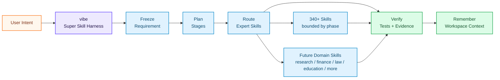

<div align="right">
  <b>🇬🇧 English</b> &nbsp;|&nbsp; <a href="./README.zh.md">🇨🇳 中文</a>
</div>

<br/>

<div align="center">

<a href="https://github.com/foryourhealth111-pixel/Vibe-Skills">
  
</a>

<br/>


<br/><br/>

### Give your AI agent a real working rhythm

Install VibeSkills, type `vibe`, and let the harness handle the busy work: understand the task, split it into stages, call the right expert Skills, check the result, and keep the context for next time. It is built to grow, so future domain Skills can plug into the same workflow instead of making every field start from scratch.

&nbsp;
*You bring the goal. VibeSkills helps the agent move from idea to plan, from plan to work, and from work to verified delivery. That is the Super Skill idea: not more buttons, but a better way for AI to get things done.*

<br/>

<table align="center">
<tr>
<td align="left">
<pre><code>&gt; vibe
  intent.freeze()        -> requirement_doc
  plan.stage()           -> xl_plan
  skills.orchestrate()   -> expert Skills by phase
  evidence.verify()      -> tests, checks, artifacts
  memory.preserve()      -> next-session context</code></pre>
</td>
</tr>
</table>

<br/>

<a href="https://github.com/foryourhealth111-pixel/Vibe-Skills/stargazers">
  
</a>
<a href="https://github.com/foryourhealth111-pixel/Vibe-Skills/network/members">
  
</a>
<a href="https://github.com/foryourhealth111-pixel/Vibe-Skills/pulse">
  
</a>

&nbsp;

&nbsp;

&nbsp;

&nbsp;

&nbsp;


<br/><br/>

🧠 Planning · 🛠️ Engineering · 🤖 AI · 🔬 Research · 🎨 Creation

<br/><br/>

<a href="docs/install/one-click-install-release-copy.en.md">
  
</a>

<br/><br/>

<a href="docs/quick-start.en.md">
  
</a>
&nbsp;
<a href="./README.zh.md">
  
</a>

<br/><br/>

<kbd>Install</kbd> &nbsp;→&nbsp;
<kbd>vibe | vibe-upgrade</kbd> &nbsp;→&nbsp;
<kbd>Harnessed Workflow</kbd> &nbsp;→&nbsp;
<kbd>Stage Skills</kbd> &nbsp;→&nbsp;
<kbd>TDD / Verification</kbd> &nbsp;→&nbsp;
<kbd>Persistent Context</kbd>

</div>

## 📋 Table of Contents

- [Runtime at a Glance](#-runtime-at-a-glance)
- [Practice Demos](#-practice-demos-real-work-you-can-see)
- [A New Kind of Super Skill](#-a-new-kind-of-super-skill)
- [What makes it different](#-what-makes-it-different)
- [Who is it for](#-who-is-it-for)
- [Intelligent Routing](#-intelligent-routing-how-340-skills-collaborate-without-conflict)
- [Memory System](#-memory-system-resume-context-across-the-same-workspace)
- [Full Capability Map](#-full-capability-map-your-all-in-one-workbench)
- [Installation & Management](#️-installation--skills-management)
- [Getting Started](#-getting-started)


<details>
<summary><b>🔑 New here? Quick glossary of key terms (click to expand)</b></summary>

<br/>

| Term | Plain-English Meaning |
|:---|:---|
| **Harness** | The workflow layer around your AI agent. It decides the next step, calls the right Skills, checks the work, and saves useful context. |
| **Skill** | A focused expert capability, such as `tdd-guide`, `code-review`, data analysis, writing, or research support. |
| **Vibe / VCO** | The canonical runtime that runs the harness. Public entrypoints are `vibe` and `vibe-upgrade`. |
| **Automatic orchestration** | The harness calls different Skills at different steps: requirements, planning, implementation, review, verification, and cleanup. |
| **Open Skill plane** | New domain Skills can plug into the same workflow, so VibeSkills can grow into research, design, education, finance, law, and more. |
| **TDD / verified delivery** | Work should be backed by tests, checks, artifacts, or explicit manual-review notes before completion is claimed. |
| **Workspace memory** | Structured project information, decisions, and evidence are stored so later sessions can continue without starting over. |

</details>

> [!IMPORTANT]
> ### 🎯 Core Vision
>
> VibeSkills starts from a simple idea: Skills are powerful, but a long tool list is not enough.
>
> A useful AI agent should know when to ask, when to plan, when to call an expert Skill, and when to prove the work is ready. You should not have to act as the full-time dispatcher.
>
> VibeSkills packages that rhythm into one plug-in Skills bundle. It gives the agent a clear path to follow, pushes work toward tests and evidence, and keeps useful context for the next session.
>
> **Install it, call `vibe`, and your agent gets a better way to move.**
> Today it can organize the bundled Skills. Tomorrow, new Skills from any domain can join the same harness.

<br/>


---

## 🛰️ Runtime at a Glance

VibeSkills is simple to use because `vibe` owns the flow. You bring the intent; the harness turns it into staged work, calls expert Skills where they fit, checks the result, and keeps the context for the next session.



<div align="center">

| Signal | What it means |
|:---|:---|
| `one entry` | Start with `vibe`; keep `vibe-upgrade` for updates. |
| `stage router` | The right Skills are called at the right step. |
| `open skill plane` | New domain Skills can join the same workflow instead of creating a new one each time. |
| `proof trail` | Tests, checks, artifacts, or manual-review state support delivery claims. |
| `memory plane` | Requirements, plans, decisions, and evidence survive the chat window. |

</div>

---

## 🎬 Practice Demos: Real Work You Can See

_People asked what VibeSkills looks like in real work. These examples are easier to judge than a feature list: each one starts with a plain goal, goes through a governed `vibe` run, and ends with something you can open, inspect, or rerun._

<div align="center">


| Demo | Starting Point | How `vibe` Moves It Forward |
|:---|:---|:---|
| **Image Workbench** | Build a GPT-image workspace for prompt chat, reference uploads, and real image generation. | Turns the idea into a product scope, UI/API tasks, workflow checks, and screenshot review. |
| **Video Editing Pipeline** | Recut a rocket moon-landing history clip into a short-video style edit. | Breaks the media work into caption, music, pacing, render, and review passes, with rough edges recorded plainly. |
| **ML Experiment + Paper** | Build a face-recognition ML demo and turn the run into a paper. | Guides dataset and model choice, training, evaluation, figure generation, and LaTeX compilation. |


</div>

The useful pattern is not just the final screenshot. A good demo also shows how the work moved:

```mermaid
flowchart LR
    accTitle: VibeSkills Practice Demo Flow
    accDescr: A user goal moves through scope confirmation, planning, skill handoff, execution checks, and an openable result.

    goal["Plain Request"]
    freeze["Confirmed Scope"]
    plan["Work Plan"]
    route["Skill Handoff"]
    work["Build / Analyze / Render"]
    proof["Checks + Evidence"]
    show["Openable Result"]

    goal --> freeze --> plan --> route --> work --> proof --> show

    classDef goal fill:#fff7ed,stroke:#f97316,stroke-width:1.5px,color:#7c2d12
    classDef flow fill:#e0f2fe,stroke:#0284c7,stroke-width:1.5px,color:#0c4a6e
    classDef proof fill:#dcfce7,stroke:#16a34a,stroke-width:1.5px,color:#14532d

    class goal goal
    class freeze,plan,route,work flow
    class proof,show proof
```



> Inspired by the [VibeSkills 3.1.0 community practice cases](https://linux.do/t/topic/2061161): a GPT-image workbench, a video-editing run, and an ML experiment that produced a paper. The best examples link to concrete outputs: a running app, a rendered clip, a compiled paper, or the commands and evidence used to produce them.

---

## 🧬 A New Kind of Super Skill

The agent-skills world is moving past "give the model more tools."

Projects like **[Superpowers](https://github.com/obra/superpowers)** show that Skills can give coding agents real discipline: clarify before coding, design before implementation, test before claiming success. **[GSD / Get Shit Done](https://github.com/gsd-build/get-shit-done)** shows another useful truth: agents need specs, milestones, context, and a way to keep work moving instead of drifting in chat history.

VibeSkills builds on that same direction, but pushes the package shape further:

> **A normal Skill says:** "Here is one thing I can do."
>
> **A Super Skill says:** "Here is how the work should run."

VibeSkills is the second kind. It wraps the workflow, expert Skills, verification, and workspace memory into one portable Skills package. More importantly, it gives future Skills a place to plug in: the same `vibe` entry can keep the work staged, checked, and easy to continue as the Skill set grows.

<div align="center">

| Project style | What it is great at | Where VibeSkills goes further |
|:---|:---|:---|
| **Traditional skill collections** | Give the agent more tools | Turns those tools into a staged, checked workflow |
| **Superpowers-style methodology** | Gives coding agents stronger habits | Brings the same idea into a broader harness that can call expert Skills by stage |
| **GSD-style project flow** | Keeps projects moving with specs, context, and milestones | Adds Skill dispatch, verification, and workspace memory as part of the runtime |
| **VibeSkills** | One portable Super Skill package for Skills-capable agents | One entry, less micromanagement, verified delivery, cross-session memory, and room for future domain Skills |

</div>

The point is not simply "more Skills." The point is that Skills should not sit in a list; they should help the agent move the work.

---


## ✨ What makes it different?

> Most skill repos answer: _"What tools can my AI use?"_
> **VibeSkills asks the question users actually feel every day: _"Can my AI pick the right Skill, use it at the right time, and prove the work is ready without making me manage every step?"_**

The operating model is intentionally simple:

<div align="center">

| Feature | What you get |
|:---|:---|
| **One entry** | Start with `vibe`; use `vibe-upgrade` to update. No long command menu to learn first. |
| **A clear work rhythm** | The agent moves through ask → plan → work → check → remember. |
| **Automatic Skill calls** | The harness picks expert Skills by task, stage, and constraints. |
| **Less micromanagement** | You do not need to keep saying "plan first", "test it", or "save the context". |
| **Verified delivery** | Work is pushed toward tests, checks, evidence, and explicit acceptance. |
| **Cross-session context** | Requirements, plans, decisions, handoff notes, and evidence are stored in predictable places. |
| **Future Skills can join** | New Skills from any domain can plug into the same workflow. |
| **Portable package** | The core is a Skills bundle, so Skills-capable agents can get the same workflow upgrade across supported hosts. |

</div>

<br/>

<div align="center">

| Without a harness | With VibeSkills |
|:---|:---|
| You keep deciding the next prompt, tool, and quality check. | `vibe` gives the agent a path and asks for confirmation where it matters. |
| Skills are a long list the agent may forget. | Skills become expert helpers called by stage and task type. |
| Each new domain tends to create another workflow for the user to learn. | New domain Skills can plug into the same `vibe` workflow. |
| "Done" can mean the model stopped talking. | Delivery is tied to tests, checks, artifacts, or explicit review state. |
| Long projects lose context across sessions. | Requirements, plans, decisions, and evidence are stored for continuation. |
| Every host needs a different workflow story. | The core stays a portable Skills package, with host adapters around it. |

</div>

<br/>

---


## 👥 Who is it for?

VibeSkills is for people who want AI agents to be easy to start, useful across many kinds of work, and less exhausting to manage.

<details>
<summary>Is this for you? Click to expand</summary>

<br/>

<div align="center">

| Audience | Description |
|:---:|:---|
| 🎯 **Users who need reliable delivery** | Want the agent to clarify, plan, test, and verify instead of rushing to an answer. |
| ⚡ **Power users of AI agents** | Need one harness to coordinate many expert Skills without micromanaging every step. |
| 🏢 **Teams standardizing AI workflows** | Want repeatable requirements, plans, verification, and handoff artifacts. |
| 🧩 **Skill builders and integrators** | Want a plug-in package model that is easy to install and portable across hosts. |
| 😩 **Users tired of tool micromanagement** | Want the system to decide which Skill belongs in which stage. |

</div>

> _If you only need one isolated script, VibeSkills may be more structure than you need. If you want an AI agent that can handle real work across phases and sessions, this is the friendly layer that makes Skills usable at scale._

</details>

<br/>

---


## 🔀 Intelligent Routing: How 340+ Skills Collaborate Without Conflict

The core point is simple: the Skills are not the product by themselves. The harness is what turns them into a usable working system.

`vibe` owns the workflow. It decides when the agent should clarify, when it should plan, which Skills are selected for the current task or stage, when tests or checks should run, and when delivery can be claimed. The user gets one simple entry instead of a pile of decisions.

<div align="center">

| Common worry | What actually happens |
|:---|:---|
| "There are too many Skills." | You do not manually choose from the whole list. The harness routes intelligently by task, phase, and constraints. |
| "Similar Skills might conflict." | The router selects Skills with bounded scope, and selected Skills stay scoped to the current phase or work unit. |
| "Multi-agent work will get chaotic." | Larger work is split into bounded units, with explicit ownership, verification, and coordinator approval. |

</div>

### How the harness works in practice

- **Start with one governed entry**: Most work enters through `vibe`, so the user does not have to choose a workflow tree manually.
- **Freeze intent before execution**: Requirements and plans become stable artifacts instead of disappearing into chat history.
- **Dispatch experts automatically by stage**: Requirement, planning, implementation, testing, review, and cleanup can each use different Skills.
- **Drive toward evidence**: TDD, targeted checks, artifact review, and delivery acceptance keep completion claims grounded.
- **Preserve context**: The runtime stores enough structure for another session or agent to continue.

---

### Why many expert Skills can coexist

- They are not all active at once.
- Some serve different stages: one clarifies, one plans, one implements, one reviews, one verifies.
- Some serve different domains: code, research, data, writing, design, documents, operations.
- Governance rules keep the harness, not the individual Skill, in charge of the final workflow.

---

### M / L / XL Execution Levels

After selecting the route, the runtime also chooses the execution grade based on task complexity:

<div align="center">

| Level | Use Case | Characteristics |
|:---:|:---|:---|
| **M** | Narrow-scope work with clear boundaries | Single-agent, token-efficient, fast response |
| **L** | Medium complexity requiring design, planning, and review | Governed multi-step execution, usually in planned serial order |
| **XL** | Large tasks with independent parts worth splitting | The coordinator breaks work into bounded units and can run independent units in parallel waves |

</div>

> Even in XL, this is not a free-for-all. The system selects the route first, then selects Skills for each bounded unit under the same governed coordinator.

---

<details>
<summary><b>🔍 Expand: wrapper entrypoints, grade overrides, and routing notes</b></summary>

<br/>

- Public discoverable entries are `vibe` and `vibe-upgrade`.
- `vibe` is progressive: it stops after `requirement_doc`, then after `xl_plan`, and only reaches `phase_cleanup` after explicit bounded re-entry approval at each boundary.
- `vibe-upgrade` runs the governed upgrade path.
- Compatibility stage IDs such as `vibe-what-do-i-want`, `vibe-how-do-we-do`, and `vibe-do-it` are disabled as public host entries. They may remain in runtime metadata for continuity, but installers must not materialize them as host-visible command or skill wrappers.
- The only lightweight public grade overrides are `--l` and `--xl`. Aliases like `vibe-l`, `vibe-xl`, or stage-plus-grade combinations are intentionally unsupported.
- When Skills such as `tdd-guide` or `code-review` are selected, they work only inside the current phase or bounded unit. They do not take over global coordination.
- In XL multi-agent work, worker lanes can surface candidate Skills, but the coordinator confirms the selected Skills.

</details>

<br/>

---


## 🧠 Memory System: Resume Context Across the Same Workspace

_Routing decides which skill should lead. Memory keeps the next session from starting cold._

<br/>

VibeSkills stores just enough governed context to make work easier to continue:

- **Resume the same project**: confirmed background, conventions, and decisions can be picked up again inside the same workspace.
- **Continue long tasks**: progress, handoff notes, and evidence anchors stay available after interruptions.
- **Reduce repeated explanation**: the agent can recover useful context without asking you to restate the same setup every session.
- **Stay scoped**: recall is bounded to the current workspace and task, so unrelated history does not flood the prompt.

| Situation | What VibeSkills helps recover |
|:---|:---|
| New session in the same workspace | Confirmed project context and working conventions |
| Interrupted task | Last useful progress, decisions, and verification clues |
| Agent handoff | Handoff notes and links to the relevant artifacts |
| Different project | Isolated memory by default |

Memory is a continuity layer, not a replacement for project truth. Git, README files, requirement docs, execution plans, and verification receipts remain the source of record. Durable memory writes stay governed, and failures are surfaced instead of silently pretending continuity exists.

See [workspace memory plane design](./docs/design/workspace-memory-plane.md) for the technical contract and [quantitative Codex memory simulation](./tests/runtime_neutral/test_codex_memory_user_simulation.py) for the benchmark coverage.


---


## ✦ Full Capability Map: Your All-in-One Workbench

_This section is not a full inventory of skill IDs. It is a practical map of the kinds of work VibeSkills can cover._

_If you only want to judge whether VibeSkills fits your task, the table below is the fastest way to read it._

<br/>

<div align="center">

| Work Area | What It Helps With | Representative Engines |
|:---|:---|:---|
| **💡 Requirements, Planning & Product Work** | Clarify vague ideas, write specs, and break work into executable plans and tasks | `brainstorming`, `writing-plans`, `speckit-specify` |
| **🏗️ Engineering, Architecture & Governed Execution** | Design systems, implement changes, and coordinate multi-step governed workflows | `aios-architect`, `autonomous-builder`, `vibe` |
| **🔧 Debugging, Testing & Quality Control** | Investigate failures, add tests, review code, and verify changes before completion | `systematic-debugging`, `verification-before-completion`, `code-review` |
| **📊 Data Analysis & Statistical Modeling** | Clean data, run statistical analysis, explore patterns, and explain results | `statistical-analysis`, `performing-regression-analysis`, `exploratory-data-analysis` |
| **🤖 Machine Learning & AI Engineering** | Train, evaluate, explain, and iterate on model-driven workflows | `senior-ml-engineer`, `scikit-learn`, `evaluating-machine-learning-models` |
| **🔬 Research, Literature & Life Sciences** | Review papers, support scientific workflows, and handle bioinformatics-heavy tasks | `literature-review`, `research-lookup`, `scanpy` |
| **📐 Scientific Computing & Mathematical Modeling** | Handle symbolic math, probabilistic modeling, simulation, and optimization | `sympy`, `pymc-bayesian-modeling`, `pymoo` |
| **🎨 Documentation, Visualization & Output** | Turn work into readable docs, charts, figures, slides, and other deliverables | `docs-write`, `plotly`, `scientific-visualization` |
| **🔌 External Integrations, Automation & Delivery** | Work with browsers, web content, external services, CI/CD, and deployment surfaces | `playwright`, `scrapling`, `aios-devops` |

</div>

<br/>

<details>
<summary><b>👉 Expand if needed: detailed categories, usage scenarios, and why similar skills coexist</b></summary>

<br/>

This section explains the full coverage in plain language.
It is meant to answer three practical questions:

1. When would this category be used?
2. Why do several similar skills exist at the same time?
3. Which entries are the representative starting points?

The names below are representative, not a full inventory dump. The point of this section is to explain roles and boundaries, not to turn the README into a warehouse list.

---

### 🧠 Requirements, Planning & Product Management

**When this gets used**: when the task is still fuzzy and the first job is to decide what problem is actually being solved before anyone starts coding.

**Why similar skills coexist**: they handle different stages of the same path. One clarifies the ask, another writes the spec, another turns that spec into a plan, and another breaks the plan into tasks.

**How you usually meet them**: early in a project, before a large change, or whenever a request is too vague to execute safely.

**Representative entries**: `brainstorming`, `speckit-clarify`, `writing-plans`, `speckit-specify`

---

### 🛠️ Software Engineering & Architecture

**When this gets used**: when the problem is clear enough to design system boundaries, make code changes, or coordinate a multi-step implementation.

**Why similar skills coexist**: some focus on architecture, some on implementation, and some on governed execution across several steps or agents. They are adjacent, but they are not doing the same job.

**How you usually meet them**: after planning is done, when a change touches several files, several layers, or several execution phases.

**Representative entries**: `aios-architect`, `architecture-patterns`, `autonomous-builder`, `vibe`

---

### 🔧 Debugging, Testing & Quality Assurance

**When this gets used**: when something is broken, risky, hard to trust, or ready for review.

**Why similar skills coexist**: debugging, testing, review, and final verification are separate actions. A quick bug-fix entrypoint is not the same thing as a disciplined debugging workflow, and neither replaces review or regression checks.

**How you usually meet them**: after a failure, before a PR, or whenever a change needs evidence instead of guesswork.

**Representative entries**: `systematic-debugging`, `error-resolver`, `verification-before-completion`, `code-review`

---

### 📊 Data Analysis & Statistical Modeling

**When this gets used**: when the main task is to understand data, clean it, test assumptions, or explain findings.

**Why similar skills coexist**: some are for cleaning and exploration, some for statistical testing, some for visualization, and some for specific data types or pipelines. They support one another, rather than duplicating one another.

**How you usually meet them**: before modeling, during experiment analysis, or anytime the question is "what does this data actually say?"

**Representative entries**: `statistical-analysis`, `performing-regression-analysis`, `detecting-data-anomalies`, `exploratory-data-analysis`

---

### 🤖 Machine Learning & AI Engineering

**When this gets used**: when the task is no longer just data understanding, but model building, evaluation, iteration, and explanation.

**Why similar skills coexist**: training, evaluation, explainability, and experiment tracking are different parts of a model workflow. A model-training skill should not be expected to cover data analysis, and an explainability skill should not be expected to replace training infrastructure.

**How you usually meet them**: after data prep is done, when you need to train something, compare results, or understand why a model behaves a certain way.

**Representative entries**: `senior-ml-engineer`, `scikit-learn`, `evaluating-machine-learning-models`, `explaining-machine-learning-models`

---

### 🧬 Research, Literature & Life Sciences

**When this gets used**: when the work itself is research-heavy, especially in literature review, scientific support, life sciences, or bioinformatics.

**Why similar skills coexist**: research workflows are naturally multi-step. One skill helps find papers, another structures evidence, another handles scientific analysis, and another focuses on life-science-specific toolchains.

**How you usually meet them**: when the request is about papers, experiments, scientific evidence, single-cell workflows, genomics, or drug-related analysis.

**Representative entries**: `literature-review`, `research-lookup`, `biopython`, `scanpy`

---

### 🔬 Scientific Computing & Mathematical Logic

**When this gets used**: when the hard part of the task is mathematical reasoning, symbolic work, formal modeling, simulation, or optimization.

**Why similar skills coexist**: some focus on symbolic derivation, some on probabilistic models, some on simulation, and some on optimization or formal logic. They may sit near each other, but they solve different kinds of mathematical work.

**How you usually meet them**: in research-heavy tasks, quantitative modeling, or workflows where natural-language reasoning is not precise enough.

**Representative entries**: `sympy`, `pymc-bayesian-modeling`, `pymoo`, `qiskit`

---

### 🎨 Multimedia, Visualization & Documentation

**When this gets used**: when the job is to turn work into something another person can read, present, review, or publish.

**Why similar skills coexist**: a chart generator, a documentation writer, a slide tool, and an image tool are all output layers, but they serve different formats and audiences. They belong in the same family because they are delivery surfaces, not because they are interchangeable.

**How you usually meet them**: near the end of a workflow, once results need to become reports, figures, slides, diagrams, or polished documentation.

**Representative entries**: `docs-write`, `plotly`, `scientific-visualization`, `generate-image`

---

### 🔌 External Integrations, Automation & Deployment

**When this gets used**: when the task depends on browsers, web content, design surfaces, external services, CI, or deployment.

**Why similar skills coexist**: browser interaction, content extraction, external service adapters, and deployment automation are related, but they solve different surface-level problems. `playwright` and `scrapling`, for example, both touch the web, but one is better for browser behavior and the other for fetching or extracting content efficiently.

**How you usually meet them**: when the work cannot stay inside the model alone and needs to touch the outside world.

**Representative entries**: `playwright`, `scrapling`, `mcp-integration`, `aios-devops`

---

Taken together, these categories are meant to cover different task types, different workflow stages, and different output surfaces. Similar skills usually coexist for predictable reasons: stage differences, domain specialization, host adaptation, or format-specific delivery.

</details>

<br/>

---


## 📊 Why is it powerful?

_Now for the numbers. This isn't a demo project — it's a running system._

The runtime core behind **VibeSkills** is **VCO**. This is not a single-point tool or a "code completion" script — it is a **super-capability network** that has been deeply integrated and governed:

<br/>

<div align="center">

|                              🧩 Skill Modules                               |                            🌍 Ecosystem                            |                               ⚖️ Governance Rules                                |
| :---------------------------------------------------------------------: | :---------------------------------------------------------------: | :----------------------------------------------------------------------: |
| <h2>340+</h2>Directly callable Skills<br/>covering the full chain from requirements to delivery | <h2>19+</h2>Absorbed high-value upstream<br/>open-source projects and best practices | <h2>129</h2>Policy rules and contracts<br/>ensuring stable, traceable, divergence-free execution |

</div>

<br/>

---


## ⚙️ Installation & Skills Management

Install first, learn the internals later. The public install path now has two clear choices: **prompt-based install** and **command install**.

Use the prompt path if you want the assistant to handle host roots and checks. Use the command path if you already know the terminal flow and want to run the commands yourself. Both paths install the same public `vibe` / `vibe-upgrade` entries.

### Option 1: Prompt-Based Install (Recommended)

This is the shortest path. Choose three things, then copy one prompt into the AI app you use:

1. Pick your host: `codex`, `claude-code`, `cursor`, `windsurf`, `openclaw`, or `opencode`.
2. Pick your action: `install` for a first install, `update` if VibeSkills is already installed.
3. Pick your version: `full` is the recommended default; `minimal` is the smaller framework-only path.
4. Open the install entry:
   [Prompt-based install (recommended)](docs/install/one-click-install-release-copy.en.md)
5. Copy the matching prompt into your AI app and let it run the install and check steps.

The prompt asks the assistant to confirm host and public version first, then run the install and checks. It does not ask you to paste secrets, URLs, or model names into chat.

### Option 2: Command Install

If you prefer to run commands directly, open:

[Multi-host command reference](docs/install/recommended-full-path.en.md)

Command install is useful when:

- you already know the target host root, such as `~/.codex` for Codex
- you want to control the `install` / `check` sequence yourself
- you are validating install behavior in CI, a test machine, or an isolated target

The common shape is:

```bash
bash ./install.sh --host <host> --profile full
bash ./check.sh --host <host> --profile full
```

See the command reference for Windows / PowerShell variants.

### `full` or `minimal`?

- Choose `full` if you want the normal VibeSkills experience.
- Choose `minimal` only if you deliberately want the smaller governance framework first.

### What install will not ask you to configure

The public install flow currently focuses on local installation, `vibe` discoverability, MCP auto-provision attempts, and base checks. Built-in online enhancement features are treated as not publicly configurable for now, so install docs do not guide normal users through provider, credential, or model setup for that path.

### Open More Docs Only When Needed

- Unsure which host root applies? Use the [cold-start host matrix](docs/cold-start-install-paths.en.md).
- Want raw commands instead of prompts? Use the [multi-host command reference](docs/install/recommended-full-path.en.md).
- Need OpenClaw or OpenCode details? Open the [OpenClaw guide](docs/install/openclaw-path.en.md) or [OpenCode guide](docs/install/opencode-path.en.md).
- Need offline setup? Use the [manual install guide](docs/install/manual-copy-install.en.md).

<details>
<summary><b>🔧 Advanced install details</b></summary>

Only read this part if you are configuring paths by hand, debugging install state, or integrating custom Skills.

**Manual configuration paths**

- Codex: `~/.codex/settings.json`
- Claude Code: `~/.claude/settings.json`
- Cursor: `~/.cursor/settings.json`
- OpenCode: `~/.config/opencode/opencode.json`
- Windsurf / OpenClaw sidecar state: `<target-root>/.vibeskills/host-settings.json`

**What install creates**

- public runtime entry: `<target-root>/skills/vibe`
- internal bundled corpus: `<target-root>/skills/vibe/bundled/skills/*`
- compatibility helper files: only when a host explicitly needs them

The `.vibeskills` folders are split on purpose:

- host-sidecar: `<target-root>/.vibeskills/host-settings.json`, `host-closure.json`, `install-ledger.json`, `bin/*`
- workspace-sidecar: `<workspace-root>/.vibeskills/project.json`, `.vibeskills/docs/requirements/*`, `.vibeskills/docs/plans/*`, `.vibeskills/outputs/runtime/vibe-sessions/*`

**Verified install behavior**

| Host | Verified areas after install |
|:---|:---|
| `codex` | planning, debug, governed execution, memory continuity |
| `claude-code` | planning, debug, governed execution, memory continuity |
| `openclaw` | planning, debug, governed execution, memory continuity |
| `opencode` | planning, debug, governed execution, memory continuity |

These checks confirm that the installed runtime still controls routing, writes governance and cleanup records, and preserves memory continuity. They do not prove every host-specific invocation path was exercised in the same run.

**Uninstall and custom skills**

- uninstall paths: `uninstall.ps1 -HostId <host>` and `uninstall.sh --host <host>`
- uninstall governance notes: [`docs/uninstall-governance.md`](docs/uninstall-governance.md)
- custom skill onboarding: [custom workflow & skill onboarding guide](docs/install/custom-workflow-onboarding.en.md)

</details>

## 📦 Standing on the Shoulders of Giants

_These capabilities were not built in isolation. VibeSkills draws on existing open-source projects, patterns, and tools, then adapts them into one governed runtime._

VibeSkills does not claim to replace or fully reproduce every upstream project listed below. The practical goal is narrower: reuse proven ideas where they fit, connect them through one runtime and governance layer, and make them easier to activate together in day-to-day work.

> 🙏 **Acknowledgements**
>
> This project references, adapts, or integrates ideas, workflows, or tooling from projects such as:
>
> `superpower` · `claude-scientific-skills` · `get-shit-done` · `aios-core` · `OpenSpec` · `ralph-claude-code` · `SuperClaude_Framework` · `spec-kit` · `Agent-S` · `mem0` · `scrapling` · `claude-flow` · `serena` · `everything-claude-code` · `DeepAgent` and more
>
> _We try to attribute upstream work carefully. If we missed a source or described a dependency inaccurately, please open an Issue and we will correct it._
>
> Contributor thanks: [xiaozhongyaonvli](https://github.com/xiaozhongyaonvli) and [ruirui2345](https://github.com/ruirui2345) for community contributions to this project.

<br/>

---


## 🚀 Getting Started

_If VibeSkills is already installed, start with one invocation._

> ⚠️ **Invocation note**: VibeSkills uses a **Skills-format runtime**. Invoke it through your host's Skills entrypoint, not as a standalone CLI program.

<br/>

<div align="center">

| Host Environment | Invocation | Example |
|:---:|:---:|:---|
| **Claude Code** | `/vibe` | `Plan this task /vibe` |
| **Codex** | `$vibe` | `Plan this task $vibe` |
| **OpenCode** | `/vibe` | `Plan this task with vibe.` |
| **OpenClaw** | Skills entry | Refer to the host docs |
| **Cursor / Windsurf** | Skills entry | Refer to each platform's Skills docs |

</div>

<br/>

- First try a small request such as planning, clarifying, or breaking down a task.
- If you want later turns to stay inside the governed workflow, append `$vibe` or `/vibe` to each message.
- If VibeSkills is not installed yet, start with [Prompt-based install (recommended)](docs/install/one-click-install-release-copy.en.md).

> MCP note: `$vibe` or `/vibe` only enters the governed runtime. It is **not MCP completion**, and it does not by itself prove that MCP is installed in the host's native MCP surface.

**Public host status**: `codex` and `claude-code` are the clearest install-and-use paths today. `cursor`, `windsurf`, `openclaw`, and `opencode` are available too, but some of those paths are still preview-oriented or host-specific.

<br/>

---

<details>
<summary><b>📚 Documentation & Installation Guides (click to expand)</b></summary>

<br/>

**Start here**

- ⚡️ [Prompt-based install (recommended)](docs/install/one-click-install-release-copy.en.md)
- 📖 [System architecture & philosophy](docs/quick-start.en.md)

**Open only if needed**

- 🛠 [Command install reference](docs/install/recommended-full-path.en.md)
- 🧩 [Custom workflow onboarding](docs/install/custom-workflow-onboarding.en.md)
- 📄 [OpenClaw host notes](docs/install/openclaw-path.en.md)
- 📄 [OpenCode host notes](docs/install/opencode-path.en.md)
- 📁 [Manual copy install (offline)](docs/install/manual-copy-install.en.md)
- 🧊 [Cold start & other environments](docs/cold-start-install-paths.en.md)

</details>

<br/>

<div align="center">

### 🤝 Join the Community · Build Together

Give it a try! If you have questions, ideas, or suggestions, feel free to open an issue — I'll take every piece of feedback seriously and make improvements.

<br/>

**This project is fully open source. All contributions are welcome!**

Whether it's fixing bugs, improving performance, adding features, or improving documentation — every PR is deeply appreciated.

```
Fork → Modify → Pull Request → Merge ✅
```

<br/>

> ⭐ If this project helps you, a **Star** is the greatest support you can give!
> Its underlying philosophy has been well-received; however, the current codebase carries some technical debt, and certain features still require refinement. We welcome you to point out any such issues in the Issues section.
> Your support is the enriched uranium that fuels this nuclear-powered donkey 🫏

<br/>

Thank you to the **LinuxDo** community for your support!

[](https://linux.do/)

Tech discussions, AI frontiers, AI experience sharing — all at Linuxdo!

</div>

<br/>

---

## Star History
<div align="center">
<a href="https://www.star-history.com/?repos=foryourhealth111-pixel%2FVibe-Skills&type=date&legend=top-left">
 <picture>
   <source media="(prefers-color-scheme: dark)" srcset="https://api.star-history.com/image?repos=foryourhealth111-pixel/Vibe-Skills&type=date&theme=dark&legend=top-left" />
   <source media="(prefers-color-scheme: light)" srcset="https://api.star-history.com/image?repos=foryourhealth111-pixel/Vibe-Skills&type=date&legend=top-left" />
   
 </picture>
</a>

---

<div align="center">
  <p><i>Transform the parts of real work most prone to going off the rails into a system that is more callable, more governable, and more maintainable over time.</i></p>
  <br/>
  <sub>Made with ❤️ &nbsp;·&nbsp; <a href="https://github.com/foryourhealth111-pixel/Vibe-Skills">GitHub</a> &nbsp;·&nbsp; <a href="./README.zh.md">中文</a></sub>
</div>
