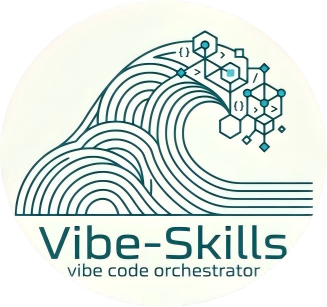
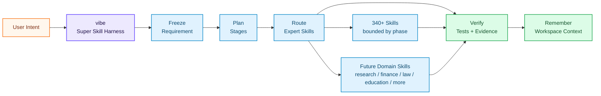

<div align="right">
  <a href="./README.md">🇬🇧 English</a> &nbsp;|&nbsp; <b>🇨🇳 中文</b>
</div>

<br/>

<div align="center">

<a href="https://github.com/foryourhealth111-pixel/Vibe-Skills">
  
</a>

<br/>



<br/><br/>

### 让 AI Agent 真正会推进任务

#### 安装 VibeSkills，输入 `vibe`，把繁琐流程交给 harness：理解任务、拆分阶段、调用合适的专家 Skills、检查结果，并把上下文留给下一次。它也为未来扩展而生，新的领域 Skills 可以接入同一套流程，不用每个领域都从零开始。

&nbsp;
*你只需要带来目标。VibeSkills 帮 AI 从想法走到计划，从计划走到执行，再从执行走到有证据的交付。这就是 Super Skill 的意义：不是更多按钮，而是让 AI 更会把事情做完。*


<table align="center">
<tr>
<td align="left">
<pre><code>&gt; vibe
  intent.freeze()        -> requirement_doc
  plan.stage()           -> xl_plan
  skills.orchestrate()   -> expert Skills by phase
  evidence.verify()      -> tests, checks, artifacts
  memory.preserve()      -> next-session context</code></pre>
</td>
</tr>
</table>

<br/>

<a href="https://github.com/foryourhealth111-pixel/Vibe-Skills/stargazers">
  
</a>
<a href="https://github.com/foryourhealth111-pixel/Vibe-Skills/network/members">
  
</a>
<a href="https://github.com/foryourhealth111-pixel/Vibe-Skills/pulse">
  
</a>

&nbsp;

&nbsp;

&nbsp;

&nbsp;

&nbsp;


<br/><br/>

🧠 规划 · 🛠️ 工程 · 🤖 AI · 🔬 科研 · 🎨 创作

<br/>

<a href="docs/install/one-click-install-release-copy.md">
  
</a>
&nbsp;
<a href="docs/quick-start.md">
  
</a>
&nbsp;
<a href="./README.md">
  
</a>

<br/><br/>

<kbd>安装</kbd> &nbsp;→&nbsp;
<kbd>vibe | vibe-upgrade</kbd> &nbsp;→&nbsp;
<kbd>受管流程</kbd> &nbsp;→&nbsp;
<kbd>阶段 Skills</kbd> &nbsp;→&nbsp;
<kbd>TDD / 验证</kbd> &nbsp;→&nbsp;
<kbd>持续上下文</kbd>

</div>

## 📋 目录

- [运行时一眼看懂](#-运行时一眼看懂)
- [实践演示](#-实践演示看得见的真实任务)
- [一种新的 Super Skill 范式](#-一种新的-super-skill-范式)
- [为什么与众不同](#-为什么它与众不同)
- [适合你吗](#-适用人群)
- [智能路由](#-智能路由机制340-技能如何协同而不冲突)
- [记忆系统](#-记忆系统让-ai-在同一工作区里持续接上上下文)
- [全景能力地图](#-全景能力地图你的全能工作台)
- [安装与管理](#️-安装与-skills-管理)
- [开始使用](#-开启你的-vibe-体验)


<details>
<summary><b>🔑 初次使用？点击展开关键概念说明</b></summary>

<br/>

| 术语 | 通俗解释 |
|:---|:---|
| **Harness** | 包在 AI Agent 外层的工作流层。它判断下一步、调用合适的 Skills、检查结果，并保存有用上下文。 |
| **Skill** | 一个聚焦的专家能力，例如 `tdd-guide`、`code-review`、数据分析、文档处理、科研写作等。 |
| **Vibe / VCO** | 运行这套 harness 的 canonical runtime。公开入口是 `vibe` 和 `vibe-upgrade`。 |
| **自动编排** | harness 在不同步骤调用不同 Skills：需求、规划、实现、评审、验证、清理，各司其职。 |
| **开放 Skill 平面** | 新领域 Skills 可以接入同一套流程，让 VibeSkills 从软件工程扩展到科研、设计、教育、金融、法律和更多方向。 |
| **TDD / 验证交付** | 完成不能只靠模型一句“做好了”，而要有测试、检查、产物证据，或明确的人工复核状态。 |
| **工作区记忆** | 结构化保存需求、计划、决策和证据，让后续会话不用从零开始。 |

</details>

> [!IMPORTANT]
> ### 🎯 核心愿景
>
> VibeSkills 的出发点很直接：Skills 很强，但一长串工具列表还不够好用。
>
> 真正好用的 AI Agent，应该知道什么时候该问清需求，什么时候该写计划，什么时候该调用专家 Skill，什么时候必须测试和验证。用户不应该一直当调度员。
>
> VibeSkills 把这套节奏封装成一个即插即用的 Skills 包。它给 AI 一条清楚的工作路径，把任务推向测试和证据，并把有用上下文留给下一次会话。
>
> **安装后调用 `vibe`，AI Agent 就有了更好的推进方式。**
> 今天它能组织内置 Skills；未来任何领域的新 Skills，也可以接入同一个 harness。

<br/>


---

## 🛰️ 运行时一眼看懂

VibeSkills 好上手，是因为 `vibe` 接管了流程。你给出目标，harness 把目标变成阶段化工作，在合适位置调用专家 Skills，检查结果，并把上下文留给下一次。



<div align="center">

| 信号 | 它代表什么 |
|:---|:---|
| `one entry` | 从 `vibe` 开始，用 `vibe-upgrade` 更新。 |
| `stage router` | 在合适步骤调用合适 Skills。 |
| `open skill plane` | 新领域 Skills 可以接入同一套流程，不需要每个领域重新发明一套 workflow。 |
| `proof trail` | 测试、检查、产物证据或人工复核状态支撑交付声明。 |
| `memory plane` | 需求、计划、决策和证据不会随着聊天窗口消失。 |

</div>

---

## 🎬 实践演示：看得见的真实任务

_社区里有人问：VibeSkills 实际用起来是什么样？下面这些案例比功能清单更容易判断。它们都从一个普通目标出发，经过一次受管的 `vibe` 流程，最后落到能打开、能检查、能复现的东西。_

<div align="center">

| 演示 | 起点 | `vibe` 如何推进 |
|:---|:---|:---|
| **图像生成工作台** | 做一个能对话改提示词、上传参考图、调用真实生图接口的 GPT-image 工作台。 | 把想法拆成产品范围、UI/API 任务、流程检查和截图复核。 | 
| **视频剪辑流水线** | 把火箭登月历史素材剪成短视频节奏。 | 拆出字幕、配乐、节奏、渲染和复核几轮工作，并把粗糙点直接记下来。 | 
| **机器学习实验 + 论文** | 做一个人脸识别 ML 演示，并把实验整理成论文。 | 推进数据集与模型选择、训练、评估、图表生成和 LaTeX 编译。 | 

</div>

好演示不只展示最终截图，也要让任务推进过程看得见：


> 这些例子参考了 [VibeSkills 3.1.0 社区实践案例](https://linux.do/t/topic/2061161)：GPT-image 工作台、视频剪辑流程，以及直出论文的机器学习实验。README 里最好链接到具体东西：可运行应用、渲染视频、编译论文，或产生它们的命令和证据。

---

## 🧬 一种新的 Super Skill 范式

AI Skills 的发展，正在从“给模型更多工具”，走向“让模型更会推进工作”。

像 **[Superpowers](https://github.com/obra/superpowers)** 这样的项目证明了：Skills 可以让 coding agent 更有纪律，先澄清、再设计、再实现、再测试。**[GSD / Get Shit Done](https://github.com/gsd-build/get-shit-done)** 则证明了另一件事：Agent 需要规格、里程碑、上下文和推进节奏，否则工作很容易散在聊天记录里。

VibeSkills 站在同一个方向上，但进一步改变了封装形态：

> **普通 Skill 说：**“我能做某件事。”
>
> **Super Skill 说：**“我知道这件事应该怎么推进。”

VibeSkills 属于第二种。它把工作流程、专家 Skills、验证和工作区记忆，封装成一个可迁移的通用 Skills 包。更重要的是，它给未来 Skills 留出了接入位置：随着 Skills 变多，同一个 `vibe` 入口仍然能让任务有阶段、有检查、能继续。

<div align="center">

| 项目类型 | 擅长什么 | VibeSkills 往前推进的地方 |
|:---|:---|:---|
| **传统 Skills 集合** | 给 Agent 增加更多工具 | 把这些工具组织成有阶段、有检查的工作流 |
| **Superpowers 式方法论** | 让 coding agent 更有开发习惯 | 把这个思路扩展成能按阶段调用专家 Skills 的 harness |
| **GSD 式项目流** | 用规格、上下文和里程碑推进项目 | 把 Skill 调度、验证和工作区记忆放进 runtime |
| **VibeSkills** | 面向 Skills Agent 的通用 Super Skill 包 | 一个入口、更少手动控制、验证交付、跨会话记忆，并能接入未来领域 Skills |

</div>

重点不是“Skills 更多”。重点是让 Skills 不再躺在列表里，而是真正帮 AI 把任务往前推进。

---


## ✨ 为什么它与众不同？

> 大多数 Skills 仓库回答的是：_"我的 AI 能用哪些工具？"_
> **VibeSkills 更关心用户每天都会遇到的问题：_"AI 能不能自己选对 Skill、在合适时间用上它，并证明任务真的做好了？"_**

<sub>适用于 **Claude Code** · **Codex** · **Windsurf** · **OpenClaw** · **OpenCode** · **Cursor** 及所有支持 Skills 协议的 AI 环境，原生兼容 **MCP**。</sub>

<br/>

<div align="center">

| 能力 | 用户得到什么 |
|:---|:---|
| **一个入口** | 从 `vibe` 开始，用 `vibe-upgrade` 更新，先不用学一长串命令。 |
| **清楚的推进节奏** | AI 按「问清楚 → 写计划 → 做任务 → 检查 → 记住上下文」推进。 |
| **自动调用 Skills** | harness 按任务、阶段和约束选择专家 Skills。 |
| **更少手动控制** | 你不用一直提醒 AI “先计划”“去测试”“别忘了保存上下文”。 |
| **验证交付** | 任务结果落到测试、检查、证据或明确人工复核状态上。 |
| **跨会话上下文** | 需求、计划、决策、交接信息和证据会存下来，方便下次接着做。 |
| **未来 Skills 可接入** | 任意领域的新 Skills 可以加入同一套流程。 |
| **通用 Skills 包** | 核心是即插即用的 Skills bundle，能给支持 Skills 的 AI Agent 带来同一套工作流升级。 |

</div>

<br/>

<div align="center">

| 没有 harness 时 | 使用 VibeSkills 后 |
|:---|:---|
| 用户自己决定下一句提示词、下一个工具、下一步质量检查。 | `vibe` 给 AI 一条路径，并在关键位置要求确认。 |
| Skills 只是一长串能力列表，AI 可能根本想不起来用。 | Skills 变成按阶段、按任务选中的工作能力。 |
| 每个新领域都容易变成一套新的使用方式。 | 新领域 Skills 可以接入同一个 `vibe` 流程。 |
| “完成”可能只是模型停止输出。 | 交付要绑定测试、检查、产物证据或明确复核状态。 |
| 长任务跨会话后上下文丢失。 | 需求、计划、决策和证据被保存，方便继续。 |
| 每个宿主都要重新设计一套使用方式。 | 核心保持为可迁移的 Skills 包，宿主适配围绕它展开。 |

</div>

<br/>

---


## 👥 适用人群

VibeSkills 适合希望 AI Agent 更容易上手、更泛用、更少手动控制的人。

<details>
<summary>适合你吗？点击展开</summary>

<br/>

<div align="center">

| 人群 | 描述 |
|:---:|:---|
| 🎯 **追求稳定交付的用户** | 希望 AI 先澄清、再规划、再测试验证，而不是直接给一个答案。 |
| ⚡ **重度使用 AI Agent 的人** | 需要一个 harness 来协调大量专家 Skills，不想每一步都自己调度。 |
| 🏢 **想规范 AI 工作流的团队** | 需要可复用的需求、计划、验证和交接产物。 |
| 🧩 **Skill 构建者与集成者** | 希望用易安装、可迁移的 Skills 包作为核心封装，适配多种宿主环境。 |
| 😩 **厌倦手动调工具的人** | 希望系统自动判断哪个阶段该用哪个 Skill。 |

</div>

> _如果你只想要一个孤立小脚本，VibeSkills 可能偏重。但如果你希望 AI Agent 能跨阶段、跨会话承接真实工作，它就是让 Skills 规模化可用、又不难上手的那层基础。_

</details>

<br/>

---


## 🔀 智能路由机制：340+ 技能如何协同而不冲突

核心点其实很简单：Skills 本身不是完整产品。harness 才是把它们组织成工作系统的关键。

`vibe` 负责整个流程：什么时候澄清，什么时候规划，什么时候选择相关 Skills 加入当前阶段，什么时候跑测试或检查，以及什么时候允许声明交付完成。用户只需要一个简单入口，不需要面对一堆选择题。

<div align="center">

| 用户常见担心 | 实际怎么处理 |
|:---|:---|
| “Skills 太多了，我怎么选？” | 不需要你从完整列表里手动挑。harness 会按任务、阶段和约束智能路由。 |
| “相似 Skills 会不会冲突？” | 路由会给它们分配有边界的职责，专项 Skills 只在当前阶段或任务单元里工作。 |
| “多代理会不会乱跑？” | 大任务会先拆成有边界的单元，再明确所有权、验证方式和协调者批准。 |

</div>

### harness 在实际里怎么协同

- **一个受管入口开始**：多数任务从 `vibe` 进入，用户不用手动选择一棵 workflow 树。
- **执行前先冻结意图**：需求和计划会变成稳定产物，而不是散落在聊天记录里。
- **按阶段选择 Skills**：需求、规划、实现、测试、评审、清理，可以各自调用不同 Skills。
- **结果必须落到证据**：TDD、定向检查、产物审阅和交付验收共同约束完成声明。
- **上下文要能延续**：运行时保存足够结构，方便下一个会话或下一个代理继续工作。

---

### 为什么大量 Skills 可以共存

- 它们不会一次性全部启动。
- 有些服务不同阶段：澄清、规划、实现、评审、验证。
- 有些服务不同领域：代码、科研、数据、写作、设计、文档、运维。
- 最终掌控工作流的是 harness，而不是某个单独 Skill。

---

### M / L / XL 执行级别

选定路线之后，运行时还会根据任务复杂度决定执行级别：

<div align="center">

| 级别 | 适用场景 | 特点 |
|:---:|:---|:---|
| **M** | 窄范围执行，边界清楚的小范围工作 | 单代理，省 token，响应快 |
| **L** | 中等复杂任务，需要设计、计划与评审 | 受管的多步骤执行，通常按计划串行推进 |
| **XL** | 适合拆分的大任务，存在彼此独立的工作单元 | 先拆单元，再由协调者按波次调度，可对独立单元并行推进 |

</div>

> 即使到了 XL，也不是“大家各自找技能乱跑”。系统会先选定路线，再为有边界的任务单元选择 Skills，整个过程仍由同一个受管协调者控制。

---

<details>
<summary><b>🔍 展开：入口 wrapper、级别覆盖与路由补充说明</b></summary>

<br/>

- 公开可发现入口固定是 `vibe` 和 `vibe-upgrade`。
- `vibe` 是渐进式入口：先在 `requirement_doc` 停止，再在 `xl_plan` 停止，只有在每个边界都得到明确 re-entry 批准后才进入 `phase_cleanup`。
- `vibe-upgrade` 负责受管升级路径。
- `vibe-what-do-i-want`、`vibe-how-do-we-do`、`vibe-do-it` 这类阶段 ID 已禁用为公开宿主入口。它们可以作为运行时连续性元数据保留，但安装器不应把它们物化成宿主可见的 command 或 skill wrapper。
- 公开允许的轻量级别覆盖只有 `--l` 和 `--xl`。像 `vibe-l`、`vibe-xl` 或阶段入口叠加级别的组合别名是故意不支持的。
- 当内部调用 `tdd-guide`、`code-review` 这类专项技能时，它们只负责当前阶段或当前任务单元，不会接管全局协调。
- 在 XL 多代理流程里，子代理可以提出候选 skill，但最终由协调者确认选中项。

</details>

<br/>

---


## 🧠 记忆系统：让 AI 在同一工作区里持续接上上下文

_路由决定该用哪个技能。记忆让下一次会话不用从零开始。_

<br/>

VibeSkills 只保留继续工作真正需要的受管上下文：

- **接上同一个项目**：同一工作区内，可以恢复已确认的背景、约定和关键决策。
- **继续长任务**：中断之后，进度、交接信息和证据线索仍然可用。
- **减少重复解释**：不用每次开新会话都重新讲一遍项目设定。
- **保持边界清楚**：记忆按当前工作区和当前任务取回，不把无关历史塞进提示词。

| 场景 | VibeSkills 帮你恢复什么 |
|:---|:---|
| 同一工作区的新会话 | 已确认的项目背景和工作约定 |
| 中断后继续任务 | 最近的有效进度、关键决策和验证线索 |
| 代理交接 | 交接说明和相关产物链接 |
| 切到另一个项目 | 默认隔离，不串上下文 |

记忆是连续性辅助层，不是项目真相来源的替代品。Git、README、需求文档、执行计划和验证 receipt 仍然是权威记录。持久记忆写入受治理约束；如果记忆能力不可用，系统会直接暴露问题，而不是假装自己还记得。

技术契约见 [工作区记忆平面设计](./docs/design/workspace-memory-plane.md)，量化验证见 [Codex 记忆仿真测试](./tests/runtime_neutral/test_codex_memory_user_simulation.py)。


---


## ✦ 全景能力地图：你的全能工作台

_这一节不是完整的 skill 名字清单，而是帮助你快速判断：VibeSkills 大致能覆盖哪些工作。_

_如果你只是想先判断它适不适合你的任务，看下面这张表就够了。_

<br/>

<div align="center">

| 工作方向 | 它主要能帮你做什么 | 代表能力 |
|:---|:---|:---|
| **💡 需求、规划与产品工作** | 把模糊想法讲清楚，写成 spec、计划和可执行任务 | `brainstorming`, `writing-plans`, `speckit-specify` |
| **🏗️ 工程开发、架构与受管执行** | 设计系统边界、落地代码改动，并协调多步骤工作流 | `aios-architect`, `autonomous-builder`, `vibe` |
| **🔧 调试、测试与质量控制** | 排查问题、补测试、做 review，并在完成前做核验 | `systematic-debugging`, `verification-before-completion`, `code-review` |
| **📊 数据分析与统计建模** | 清洗数据、做统计分析、探索模式并解释结果 | `statistical-analysis`, `performing-regression-analysis`, `exploratory-data-analysis` |
| **🤖 机器学习与 AI 工程** | 训练、评估、解释并迭代模型相关工作流 | `senior-ml-engineer`, `scikit-learn`, `evaluating-machine-learning-models` |
| **🔬 科研、文献与生命科学** | 做文献检索、科研支持，以及偏生信和生命科学的任务 | `literature-review`, `research-lookup`, `scanpy` |
| **📐 科学计算与数学建模** | 处理符号推导、概率建模、仿真和优化问题 | `sympy`, `pymc-bayesian-modeling`, `pymoo` |
| **🎨 文档、可视化与交付输出** | 把结果整理成文档、图表、图像、幻灯片等可交付内容 | `docs-write`, `plotly`, `scientific-visualization` |
| **🔌 外部集成、自动化与交付** | 连接浏览器、网页、外部服务、CI/CD 和部署流程 | `playwright`, `scrapling`, `aios-devops` |

</div>

<br/>

<details>
<summary><b>👉 按需展开：查看更细的能力分类、适用场景与分工</b></summary>

<br/>

这一部分讲的是完整覆盖面，但会尽量说人话。
它主要回答三个实际问题：

1. 你在什么场景下会用到这一类能力？
2. 为什么会同时保留几个看起来相近的 skill？
3. 这一类里，哪些是比较典型的代表项？

下面列的是代表项，不是把所有 skill 名字一股脑堆出来。重点是把角色和分工讲清楚，而不是把 README 写成库存表。

---

### 🧠 需求、规划与产品管理

**什么时候会用到**：当任务还很模糊，第一步不是写代码，而是先搞清楚“到底要解决什么问题”。

**为什么会共存**：它们解决的是同一条链路上的不同环节。一个负责澄清需求，一个负责写 spec，一个负责把 spec 拆成计划，还有的继续往下拆成任务。

**通常怎么遇到**：项目刚开始时、需求还没冻结时，或者要做高风险改动前。

**代表项**：`brainstorming`, `speckit-clarify`, `writing-plans`, `speckit-specify`

---

### 🛠️ 软件工程与架构设计

**什么时候会用到**：当问题已经比较清楚，开始进入“怎么设计、怎么实现、怎么协调落地”这一步。

**为什么会共存**：有的偏架构和边界设计，有的偏具体开发落地，有的偏多步骤、多代理的受管执行。它们很近，但不是一回事。

**通常怎么遇到**：规划完成后，任务开始涉及多文件修改、多层结构或多阶段执行时。

**代表项**：`aios-architect`, `architecture-patterns`, `autonomous-builder`, `vibe`

---

### 🔧 调试、测试与质量保证

**什么时候会用到**：当东西坏了、风险高、需要补测试，或者准备提交 review 的时候。

**为什么会共存**：排错、写测试、做 review、做完成前核验，本来就是不同动作。一个偏快速修复入口，另一个偏严格排障流程，谁都不能完全替代谁。

**通常怎么遇到**：报错之后、PR 之前，或者改动完成后需要拿证据说话的时候。

**代表项**：`systematic-debugging`, `error-resolver`, `verification-before-completion`, `code-review`

---

### 📊 数据分析与统计建模

**什么时候会用到**：当重点是“看数据、清数据、解释数据”，而不是先上模型。

**为什么会共存**：有的负责清洗和探索，有的负责统计检验，有的负责可视化，有的适合特定数据类型或处理链路。它们是配合关系，不是重复关系。

**通常怎么遇到**：建模前、实验分析时，或者当你真正想问“这些数据到底说明了什么”。

**代表项**：`statistical-analysis`, `performing-regression-analysis`, `detecting-data-anomalies`, `exploratory-data-analysis`

---

### 🤖 机器学习与 AI 工程

**什么时候会用到**：当任务目标已经从“理解数据”变成“训练、评估、解释和迭代模型”。

**为什么会共存**：训练、评估、可解释性、实验记录本来就不是同一个动作。模型训练 skill 不等于数据分析 skill，可解释性 skill 也不该替代训练链路。

**通常怎么遇到**：数据准备完成后，需要真正跑模型、比较结果，或者理解模型为什么这样输出时。

**代表项**：`senior-ml-engineer`, `scikit-learn`, `evaluating-machine-learning-models`, `explaining-machine-learning-models`

---

### 🧬 科研、文献与生命科学

**什么时候会用到**：当任务本身是科研工作，尤其是文献整理、研究支持、生命科学或生信分析。

**为什么会共存**：科研流程天然就是多步的。有人负责找论文，有人负责整理证据，有人负责分析实验数据，也有人负责生命科学专用工具链。

**通常怎么遇到**：做文献综述、单细胞分析、基因组学任务，或药物和实验支持类工作时。

**代表项**：`literature-review`, `research-lookup`, `biopython`, `scanpy`

---

### 🔬 科学计算与数学逻辑

**什么时候会用到**：当问题真正难的地方在数学推导、形式化建模、仿真或优化上。

**为什么会共存**：有的偏符号推导，有的偏概率模型，有的偏仿真，有的偏优化或形式逻辑。它们都跟“算”有关，但处理的不是同一种问题。

**通常怎么遇到**：科研任务、量化建模，或者自然语言解释已经不够精确的场景里。

**代表项**：`sympy`, `pymc-bayesian-modeling`, `pymoo`, `qiskit`

---

### 🔌 外部集成、自动化与部署

**什么时候会用到**：当任务离不开浏览器、网页内容、设计平台、外部服务、CI 或部署环境。

**为什么会共存**：浏览器交互、页面抓取、外部服务适配、部署自动化虽然都属于“连接外部世界”，但解决的是不同层面的工作。比如 `playwright` 和 `scrapling` 都碰网页，但一个更适合浏览器行为，一个更适合抓取和提取内容。

**通常怎么遇到**：当任务已经不能只靠模型本身完成，而是必须去碰外部系统的时候。

**代表项**：`playwright`, `scrapling`, `mcp-integration`, `aios-devops`

---

### 🎨 文档、可视化与交付输出

**什么时候会用到**：当任务结果需要被别人阅读、展示、评审或交付出去的时候。

**为什么会共存**：图表、文档、幻灯片、图片虽然都属于输出层，但服务的格式和对象不同。它们被放在一类，是因为都承担“把结果变成可交付物”的职责，而不是因为可以互相替代。

**通常怎么遇到**：工作流后段，当分析结果、研究结论或工程产出需要变成报告、图示、幻灯片或更完整的文档时。

**代表项**：`docs-write`, `plotly`, `scientific-visualization`, `generate-image`

---

合起来看，这些类别覆盖的是不同任务类型、不同工作阶段和不同交付形式。相似 skill 同时存在，通常不是为了重复堆料，而是因为它们分别承担了阶段差异、领域差异、宿主适配，或输出格式差异带来的不同职责。

</details>

<br/>

---


## 📊 为什么说它强大？

_看完完整版图，来看实际数字。这不是演示项目，而是已经跑起来的系统：_

**VibeSkills** 背后的运行时核心是 **VCO**。它绝不仅仅是一个单点工具或只会"补代码"的脚本，而是一个已完成高度整合与治理的**超级能力网络**：

<br/>

<div align="center">

|                              🧩 技能模块                               |                            🌍 生态融合                            |                               ⚖️ 治理规则                                |
| :---------------------------------------------------------------------: | :---------------------------------------------------------------: | :----------------------------------------------------------------------: |
| <h2>340+</h2>可直接调用的 Skills<br/>覆盖从需求规划到执行的完整链路 | <h2>19+</h2>吸收高价值上游开源项目<br/>与最佳实践来源 | <h2>129 条</h2>基于配置的策略与契约<br/>确保执行稳定、可溯源、防发散 |

</div>

<br/>

---


## ⚙️ 安装与 Skills 管理

先装起来，再慢慢了解内部机制。现在公开安装路径分成两种：**提示词安装** 和 **命令安装**。

如果你不想处理路径和命令，选提示词安装；如果你已经熟悉终端，想自己控制执行过程，选命令安装。两条路径安装的是同一套 `vibe` / `vibe-upgrade` 公开入口。

### 方式一：提示词安装（推荐）

这是最省心的路径。你只需要选三件事，然后复制一段提示词给正在使用的 AI 客户端：

1. 选宿主：`codex`、`claude-code`、`cursor`、`windsurf`、`openclaw`、`opencode`
2. 选动作：第一次安装选 `install`，已经装过再选 `update`
3. 选版本：普通用户推荐 `full`，只想要轻量框架时选 `minimal`
4. 打开安装入口：
   [提示词安装（推荐）](docs/install/one-click-install-release-copy.md)
5. 把对应提示词粘贴到你的 AI 客户端里，让它执行安装和检查

提示词安装会要求安装助手先确认宿主和公开版本，再运行安装与检查；它不会要求你把密钥、URL 或模型名粘贴到聊天里。

### 方式二：命令安装

如果你想直接在终端执行，打开：

[多宿主命令参考](docs/install/recommended-full-path.md)

命令安装适合这些情况：

- 你已经知道目标宿主根目录，比如 Codex 的真实根目录是 `~/.codex`
- 你希望自己控制 `install` / `check` 的执行顺序
- 你在 CI、测试机器或隔离目录里验证安装行为

最常见的形态是：

```bash
bash ./install.sh --host <host> --profile full
bash ./check.sh --host <host> --profile full
```

Windows / PowerShell 路径见命令参考页。

### `full` 还是 `minimal`？

- 想获得正常的 VibeSkills 体验，就选 `full`
- 只有你明确想先装轻量治理框架时，再选 `minimal`

### 安装时不会要求配置什么？

公开安装暂时只关注本地安装、`vibe` 可发现、MCP 尝试接入和基础检查。内置在线增强能力仍按未开放配置处理，安装说明不会引导普通用户配置这部分 provider、凭据或模型。

### 什么时候再看更多文档？

- 不确定宿主根目录：看 [冷启动宿主矩阵](docs/cold-start-install-paths.md)
- 想直接看命令：看 [多宿主命令参考](docs/install/recommended-full-path.md)
- 需要 OpenClaw / OpenCode 细节：看 [OpenClaw 宿主说明](docs/install/openclaw-path.md) 或 [OpenCode 宿主说明](docs/install/opencode-path.md)
- 需要离线安装：看 [手动复制安装](docs/install/manual-copy-install.md)

<details>
<summary><b>🔧 高级安装细节</b></summary>

下面这些内容只在你需要手动配置路径、排查安装状态或接入自定义 Skills 时再看。

**手动配置路径**

- Codex：`~/.codex/settings.json`
- Claude Code：`~/.claude/settings.json`
- Cursor：`~/.cursor/settings.json`
- OpenCode：`~/.config/opencode/opencode.json`
- Windsurf / OpenClaw sidecar：`<target-root>/.vibeskills/host-settings.json`

**安装会创建什么**

- 对外运行时入口：`<target-root>/skills/vibe`
- 内部 bundled 语料：`<target-root>/skills/vibe/bundled/skills/*`
- 兼容性辅助文件：只有宿主明确需要时才生成

`.vibeskills` 被拆成两层：

- host-sidecar：`<target-root>/.vibeskills/host-settings.json`、`host-closure.json`、`install-ledger.json`、`bin/*`
- workspace-sidecar：`<workspace-root>/.vibeskills/project.json`、`.vibeskills/docs/requirements/*`、`.vibeskills/docs/plans/*`、`.vibeskills/outputs/runtime/vibe-sessions/*`

**已验证的安装行为**

| 宿主 | 已验证的范围 |
|:---|:---|
| `codex` | planning、debug、governed execution、memory continuity |
| `claude-code` | planning、debug、governed execution、memory continuity |
| `openclaw` | planning、debug、governed execution、memory continuity |
| `opencode` | planning、debug、governed execution、memory continuity |

这些检查说明：安装后的 `vibe` 仍然能负责路由、写出治理和清理记录，并保持记忆连续性；但不等于每一种宿主调用方式都在同一次验证里完整跑过。

**卸载和自定义**

- 卸载入口：`uninstall.ps1 -HostId <host>`、`uninstall.sh --host <host>`
- 卸载治理说明：[`docs/uninstall-governance.md`](docs/uninstall-governance.md)
- 自定义 Skill 接入：[自定义工作流与 Skill 接入指南](docs/install/custom-workflow-onboarding.md)

</details>

## 📦 集众家之所长：资源整合

_这些能力不是闭门造车做出来的。VibeSkills 会参考现有开源项目、方法和工具，再把适合的部分接入同一套受管运行时。_

VibeSkills 并不声称要替代、也不会完整复刻下面列出的每一个上游项目。更实际的目标是：在合适的地方复用已经被验证的方法和能力，再通过同一套运行时与治理层把它们串起来，减少日常使用时的切换和拼装成本。

> 🙏 **鸣谢**
>
> 本项目参考、适配或接入了以下项目中的部分思路、工作流或工具能力：
>
> `superpower` · `claude-scientific-skills` · `get-shit-done` · `aios-core` · `OpenSpec` · `ralph-claude-code` · `SuperClaude_Framework` · `spec-kit` · `Agent-S` · `mem0` · `scrapling` · `claude-flow` · `serena` · `everything-claude-code` · `DeepAgent` 等等
>
> _我们会尽量认真处理上游来源的署名与说明。如果有遗漏，或某处表述不准确，欢迎在 Issue 中指出，我们会及时修正。_
>
> 贡献者鸣谢：[xiaozhongyaonvli](https://github.com/xiaozhongyaonvli) 和 [ruirui2345](https://github.com/ruirui2345)，感谢你们对本项目的社区贡献。

<br/>

---


## 🚀 开启你的 Vibe 体验

_如果你已经装好了 VibeSkills，接下来只需要一次调用。_

> ⚠️ **调用说明**：VibeSkills 采用 **Skills 格式运行时**，请从宿主环境的 Skills 入口调用，**不要**把它当成独立 CLI 程序直接运行。

<br/>

<div align="center">

| 宿主环境 | 调用方式 | 示例 |
|:---:|:---:|:---|
| **Claude Code** | `/vibe` | `请帮我规划这个任务 /vibe` |
| **Codex** | `$vibe` | `请帮我规划这个任务 $vibe` |
| **OpenCode** | `/vibe` | `请用 vibe 帮我规划这次改动。` |
| **OpenClaw** | Skills 入口 | 参考宿主说明 |
| **Cursor / Windsurf** | Skills 入口 | 参考各平台 Skills 调用文档 |

</div>

<br/>

- 第一次可以先从一个很小的请求开始，比如让它先帮你澄清、规划或拆分任务。
- 如果你希望后续每一轮都留在受管工作流里，就在每条消息后面继续附上 `$vibe` 或 `/vibe`。
- 如果你还没安装，先回到 [提示词安装（默认推荐）](docs/install/one-click-install-release-copy.md)。

> MCP 说明：`$vibe` 或 `/vibe` 只表示进入 governed runtime，**不等于 MCP 完成**，也不能单独证明某个 MCP 已安装到宿主原生 MCP 配置面。

**当前宿主状态**：`codex` 和 `claude-code` 是目前最清晰、最完整的安装与使用路径。`cursor`、`windsurf`、`openclaw`、`opencode` 也可用，但其中一部分仍偏 preview 或带宿主特定约束。

<br/>

---

<details>
<summary><b>📚 文档导航与安装指引（点击展开）</b></summary>

<br/>

**先看这两个**

- ⚡️ [提示词安装（默认推荐）](docs/install/one-click-install-release-copy.md)
- 📖 [了解系统架构与理念](docs/quick-start.md)

**下面这些按需再看**

- 🛠 [命令安装参考](docs/install/recommended-full-path.md)
- 🧩 [自定义工作流接入](docs/install/custom-workflow-onboarding.md)
- 📄 [OpenClaw 宿主说明](docs/install/openclaw-path.md)
- 📄 [OpenCode 宿主说明](docs/install/opencode-path.md)
- 📁 [手动复制安装（离线）](docs/install/manual-copy-install.md)
- 🧊 [冷启动与其他环境说明](docs/cold-start-install-paths.md)

</details>

<br/>

<div align="center">

### 🤝 加入社区 · 共建生态

欢迎来尝试和体验！有问题、有想法、有建议，欢迎随时提出——鄙人不才，一定认真听取和修改。

<br/>

**本项目完全开源，欢迎一切形式的贡献！**

无论是修复 bug、提升性能、添加新功能还是完善文档，你的每一个 PR 都弥足珍贵。

```
Fork → 修改 → Pull Request → 合并 ✅
```

<br/>

> ⭐ 如果这个项目对你有帮助，点个 **Star** 是对我最大的支持！
> 它的理念受到了大家的欢迎，但目前的底层代码存在一些技术债，功能也有待完善，欢迎大家在issue区指出。
> 您的支持也是我这个核动力驴的浓缩 U-235 :blush:

<br/>

感谢 **LinuxDo** 各位佬的支持！

[](https://linux.do/)

各种技术交流、AI 前沿资讯、AI 经验分享，尽在 Linuxdo！

</div>

<br/>

---


## Star History

<a href="https://www.star-history.com/?repos=foryourhealth111-pixel%2FVibe-Skills&type=date&legend=top-left">
  <picture>
    <source media="(prefers-color-scheme: dark)" srcset="https://api.star-history.com/image?repos=foryourhealth111-pixel/Vibe-Skills&type=date&theme=dark&legend=top-left" />
    <source media="(prefers-color-scheme: light)" srcset="https://api.star-history.com/image?repos=foryourhealth111-pixel/Vibe-Skills&type=date&legend=top-left" />
    
  </picture>
</a>

<br/>

---

<div align="center">
  <p><i>把真实工作里最容易失控的部分，变成一个更可调用、更可治理、也更可长期维护的系统。</i></p>
  <br/>
  <sub>Made with ❤️ &nbsp;·&nbsp; <a href="https://github.com/foryourhealth111-pixel/Vibe-Skills">GitHub</a> &nbsp;·&nbsp; <a href="./README.md">English</a></sub>
</div>
