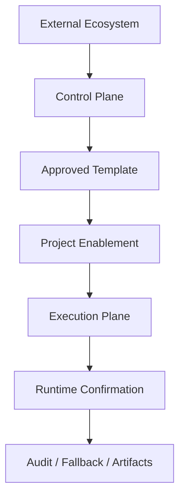

# Automation Plane Architecture

本文件说明 VCO 如何吸收外部工具价值而**不把外部平台直接并入核心运行面**。核心思想：把外部能力拆成 **control plane** 与 **execution plane**，用 admission policy + runtime policy 双层治理。

## 1. Design Goals

- 让外部工具可用，但不默认常驻；
- 让 catalog 可研究，但不自动授权；
- 让写操作可落地，但必须强确认、可回滚、可审计；
- 保持 VCO 本体仍然是 orchestrator，而不是 connector platform。

## 2. Two Planes

### Control Plane

控制面位于 VCO 仓内的治理资产：

- `config/tool-registry.json`
- `config/tool-risk-tiers.json`
- `config/egress-allowlist.json`
- `config/secrets-policy.json`
- `references/*.md|*.json`
- `scripts/verify/*.ps1`
- `scripts/research/*.ps1`

职责：

- 定义准入状态；
- 维护风险、egress、secret、contract、catalog snapshot；
- 证明“某个模板可以被项目安全启用”。

### Execution Plane

执行面只包含在具体项目中显式启用的最小能力：

- 已配置好的 MCP endpoint；
- 项目级 token / vault handle；
- 已知 action subset；
- 已连接的确认节点与降级路径。

职责：

- 执行被允许的 read / transform / write 动作；
- 在运行时执行 confirm、fallback、artifact 输出；
- 不承担 catalog 扩张、风险定义与平台治理职责。

## 3. Admission Policy vs Runtime Policy

### Admission Policy

回答“这个工具**有没有资格**进入模板层”：

- 它是否解决真实缺口；
- 是否存在重复能力；
- 风险 tier 是否已定义；
- egress / secret / contract 是否完整；
- verify gate 是否能检测其完整性。

### Runtime Policy

回答“这个工具**在这一次执行里能做什么**”：

- 当前 action 是否属于允许集合；
- 是否需要 per-action confirmation；
- 是否允许运行在 unattended 模式；
- 是否必须隔离执行；
- 是否应该先输出 artifact 而不是直接回写系统。

## 4. Why Not Embed External Platforms

### Activepieces

Activepieces 提供的是 automation/control plane，不是 VCO 核心 runtime 的组成部分。把平台本身并入 VCO 会带来：

- 平台升级耦合；
- 权限边界模糊；
- 开放式 connector 面暴露；
- 责任归属从“项目 enablement”变成“VCO 默认担责”。

因此 VCO 只吸收：

- 风险建模方式；
- project-scoped MCP template；
- 控制面治理边界。

### Composio

Composio 的价值在于统一 tool router 与 session-scoped action surface，但它同样属于外部 control plane。VCO 不默认信任其完整 provider catalog，只吸收：

- 受约束的 action subset；
- session endpoint 治理；
- tool registry / secret / egress 接线方式。

### Docling

Docling 的价值在于文档解析与格式归一，而不是成为 VCO 的常驻文档 runtime。VCO 只吸收：

- opt-in parser template；
- output contract；
- isolated runtime 策略；
- 大文件 / OCR / warning / provenance 规范。

## 5. Enablement Levels

| Level | Meaning | Default |
|---|---|---|
| `reference-only` | 只研究，不执行 | Yes |
| `approved-template` | 可以作为项目模板 | No |
| `project-enabled` | 项目显式启用 | No |

这保证了“收集高价值项目”不会自动变成“默认扩大运行面”。

## 6. Guardrails

- 未注册域名不出网；
- 未注册 secret ref 不启用；
- `tier2` / `tier3` 必须逐动作确认；
- `tier3` 不允许 unattended；
- catalog snapshot 只能写到 `references/`，不能直接写入 registry；
- 结构化 parser 必须定义 contract / warning / failure mode。

## 7. Failure and Degraded Modes

当外部工具不可用时：

- 保留 control plane 资产不变；
- execution plane 回退为 `manual reference`、本地替代工具或用户确认中止；
- 不因为某个平台临时不可用就修改核心 routing / governance 规则。

换言之，VCO 要做到：**工具可以失效，治理不能失效**。
